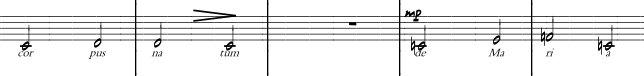
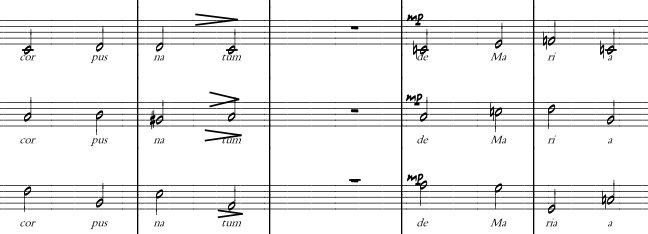

# INT – Introduction to Formal Languages and Theory of Computation

## Topics Related to the Problem

* Formal languages
* Representation of languages
* Operations on languages

## Problem Presentation

An art collector owns musical scores and recordings that need to be cataloged and processed by computer. This collector is very demanding about how his material is handled and insists that, for every piece in his collection, the score corresponds exactly to its recording.

Some of the scores in his collection are written for a single instrument, while others involve several instruments. Each single-instrument score can be viewed as a sequence of musical symbols. In the case of multi-instrument scores, they can also be seen as sequences — but of *composite symbols*: each element of the sequence consists of a finite number of musical symbols. Each piece of music may contain an arbitrary number of symbols.

Below are examples of scores for one instrument and for three instruments, respectively:

### One Instrument

Note that each note can be independently viewed as a symbol (written on a staff).
In the following example, corresponding to a score for three instruments, each one has a similar representation: every instrument has its own staff, and the notes are aligned vertically at each beat.

### Three Instruments

Each piece of music may belong to one or more musical genres. For each genre, the collector needs to define which pieces belong to it. Some genres consist of a finite set of pieces, while others are defined more generally by their meter patterns (for example, the genre of waltzes is formed by all pieces written in 3/4 time).

Our collector does not tolerate errors in the answers to his questions. He has formulated several questions that must be answered with complete certainty — that is, each must be supported by a mathematical justification.

Fortunately, the **Theory of Computation** provides us with the tools to address the collector’s questions, since each musical note can be viewed as a symbol that can be used to build sequences, which in turn represent scores for single instruments.

## Questions (to be answered by the group, always with justification)

1. Is it true that each piece of music can be viewed as a string?
2. Is it possible to form a piece of music by concatenating other pieces? Can the result also be considered a piece of music?
3. Is a segment of a given piece also a piece of music? The segment may appear at the beginning, middle, or end of the original piece.
4. If I decide to rewrite a piece of music in reverse order (from end to beginning), can the result still be considered a piece of music? What operation should I apply to obtain this “reversed” music?
5. The set of rock songs I own has 3,500 elements. I have a set of 700 operas. I also keep a set of songs that I would still like to compose — but for now, that set contains no songs at all. To help me through this creative gap, define the following sets:

   a) The set of songs formed by the initial segments (first 20 notes) of each rock song in my collection.
   b) The set formed by the repetition of the same song 0, 1, 2, 3, 4, 5, … times.
   c) The set containing only the *empty song* (one that contains no notes).
   d) The set of romantic songs: {m | m is a song that contains the word “love” in its lyrics}.
   e) The set of songs that are operas **or** romantic.
   f) The set of songs that are both operas **and** rock songs.
   g) If I have collections of waltzes for flute, piano, trumpet, and cello — how can I obtain a collection of waltzes for the four instruments combined?
   h) Is it possible to form the collection of all songs that are **not operas**?
   i) Knowing both the score and its corresponding MP3 file, is it possible to use one in place of the other (can one be seen as an encoding of the other)?

